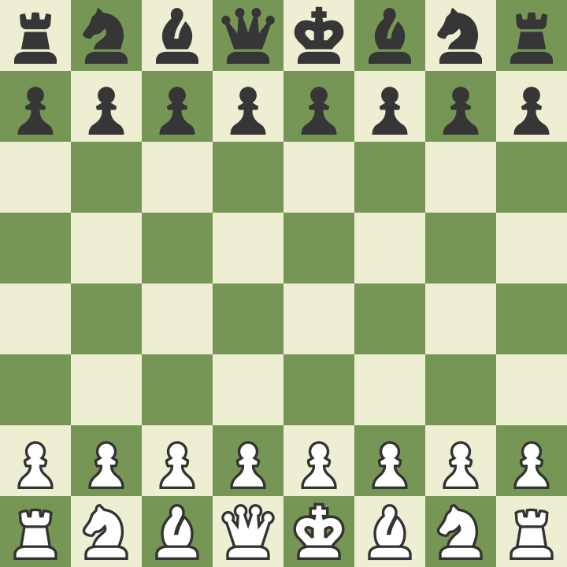

# CHESS-SARA  
  
## Introduction  
  
This repository focuses on creating chess engine **S.A.R.A - Strategic Adaptive Reevaluation Algorithm** which is a Deep RL  
algorithm which uses *CNN* along with *Proximal Policy approximation*  
  
## Data Preparation  

### Inputs:

The data used is obtained from [FICS Game Database](https://www.ficsgames.org/download.html). Processed games from 2024 for version-1  
  
  
  
- We Preprocessed nearly 70k games using *Stockfish-Style Representation* in which we create (19, 8, 8 ) tensor:  
- 11 represents the piece position for both white(lower number) and black(upper number)  
  - 0 , 6 -  Pawns  
  - 1,  7 -  knights  
  - 2, 8 - Bishops  
  - 3, 9 - Rooks  
  - 4, 10 - Queens  
  - 5, 11 - King  
- 12 represents whose turn it is **1 if white, 0 if black**  
- 13 - 16 represents castling rights for each king:  
  - 13, 15 - King and Queen side castling for the White king  
  -  14, 16 - King and Queen side castling for the Black king  
- 17 represents *En Passant* opportunity  
- 18 ensure we enforce the *[50 move rule](https://en.wikipedia.org/wiki/Fifty-move_rule#:~:text=The%20fifty%2Dmove%20rule%20in,the%20opponent%20completing%20a%20turn)*  
  
This Gives much more information, such as the historical context to train the model with but it has its own pros and cons  
  
#### Pros
  
✅ Encodes additional game features (castling, en passant, move history).  
  
✅ More expressive for reinforcement learning (good for AlphaZero-style models).  
  
✅ Side-to-move plane helps with learning asymmetry in move choices.  
  
#### Cons  

❌ Larger tensor size (8×8×19 = 1216 values per position).  
  
❌ More computationally expensive tha traditional 12 channel tensors (*Bitboards*).  
  
❌ Still lacks deeper history, e.g., past N board states for move sequence modeling.

### Outputs:

For the training we are using the following as the expected outputs:

-  **Policy Output (Move Prediction):** This takes care of predicting the next move, its is 4672(Total legal moves) one hot coded vector with all zeros except the move which was played, then it is encoded using a Encoder neural Net
	
``` python
class MoveEmbedding(nn.Module):   
     def __init__(self, move_vocab_size=4672, embed_dim=128):  
        super().__init__()  
        self.embed = nn.Embedding(move_vocab_size, embed_dim)  
  
    def forward(self, move_index):  
        return self.embed(move_index)
```

- **Value Output (Position Evaluator):** This is a floating point *centipawn score* which comes from **Stockfish Evaluation** of the position. we normalise the value where  $score \in [-1,  1]$ , negative value means black is doing well and positive means white is doing well and a score of -1 or 1 means there is a forced mate for black and white respectively

``` python
if score.is_mate():  
    return 1.0 if score.mate() > 0 else -1.0  
else:  
    return np.tanh(score.score() / 800.0)
```